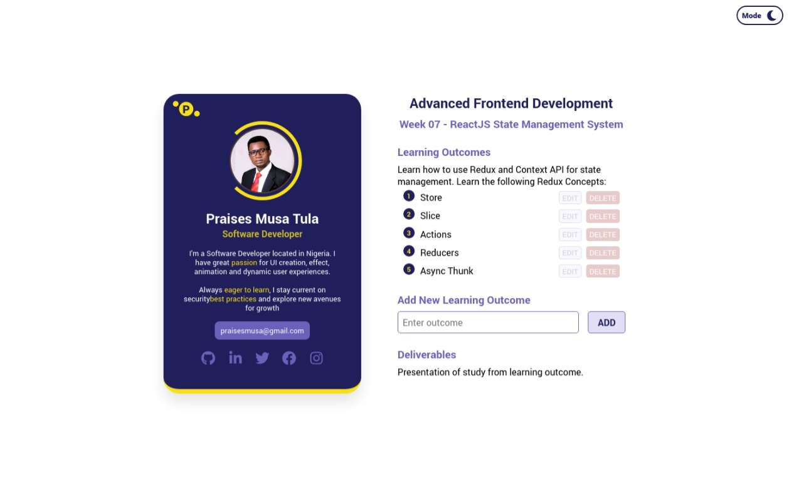

# FIP Week 07 Deliverable || ReactJS State Management

## 📗 Description

> This repository shows my week 07 deliverables for the Flexisaf Internship Program (FIP) - Advanced Frontend Development track. The learning outcomes is to learn about ReactJS state management using Redux and Context API.

## 🛠 Tech Stack

> Stack for this deliverables are:

- Git/GitHub
- Terminal/Command Line (CL)
- Markups (HTML & CSS)
- JavaScript

## 🚀 Preview

> Light Mode Preview



> Dark Mode Preview


## 💡 Getting Started

### Prerequisites

> The following applications are required to be installed for the project to run!

- Install a modern browser e.g. [Google Chrome](https://www.google.com/chrome/), [Edge](https://www.microsoft.com/en-us/edge?r=1), [Firefox](https://www.mozilla.org/en-US/exp/firefox/new/) etc.
- Install [Git](https://git-scm.com/downloads)

### Setup

Clone this repository to your desired folder:

```sh
  git clone git@github.com:PraisesPJMT/fip-state-management
  cd fip-state-management
```

### Install

Install this project (dependencies) with:

```sh
  npm install
```

### Usage

To run the project, execute the following command:

```sh
  npm run dev
```

- After running `npm run dev`, use the app on [http://localhost:5173/](http://localhost:5173/) in the browser!
- For more information please visit [Vite](https://vitejs.dev/guide/).

## 👤 Contact Me [Praises Tula]

> **Github:** [@PraisesPJMT](https://github.com/PraisesPJMT/)
>
> **LinkedIn:** [Praises Musa Tula](https://www.linkedin.com/in/praises-tula/)
>
> **Twitter:** [@PraisesPJMT](https://twitter.com/PraisesPJMT/)
>
> **Email:** [praisesmusa@gmail.com](mailto:praisesmusa@gmail.com)
